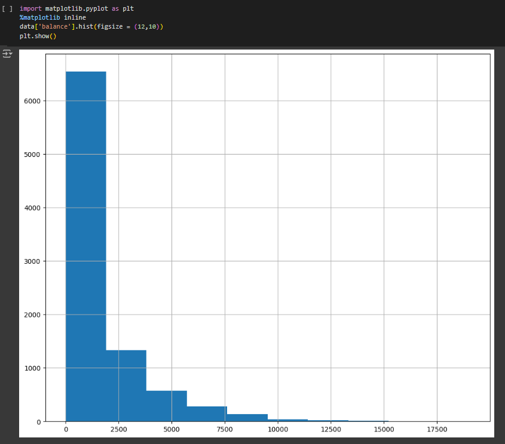
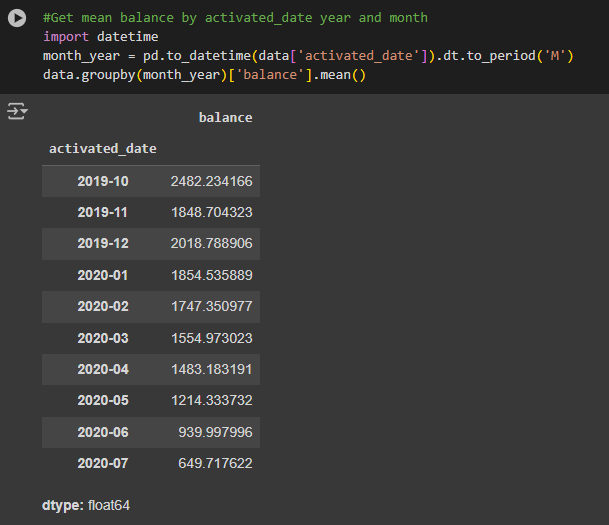
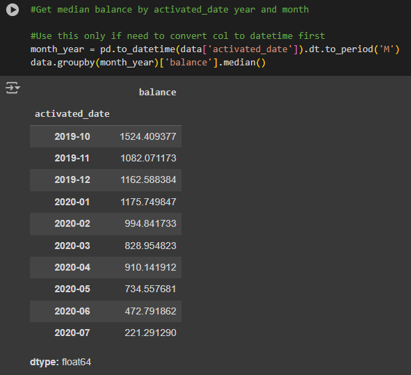
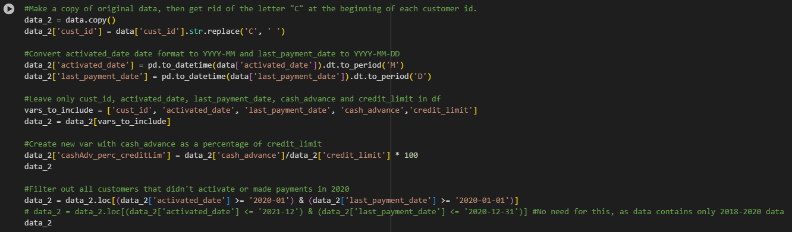
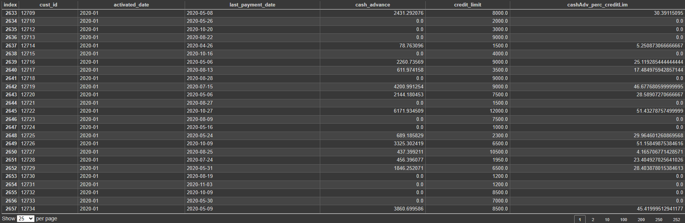
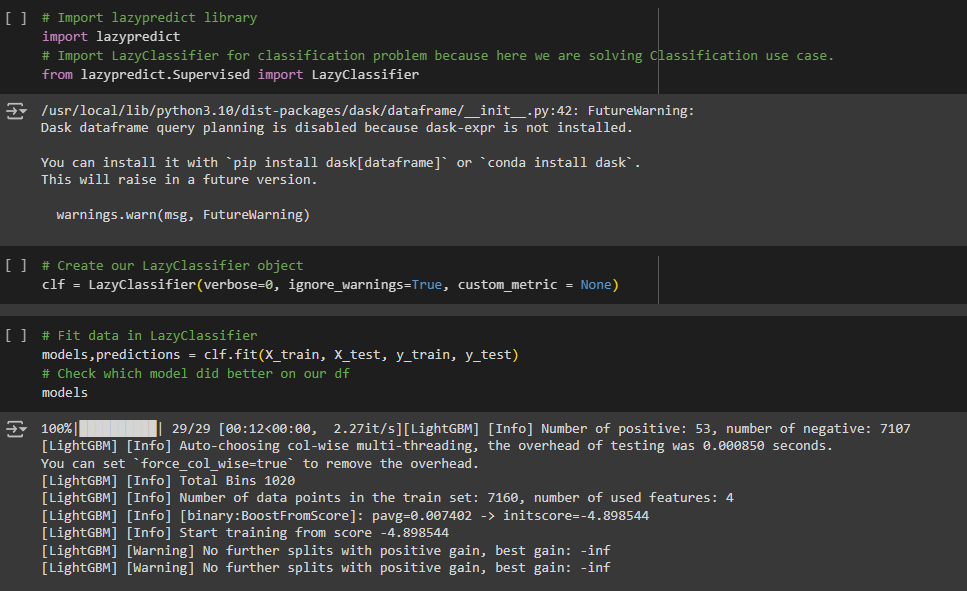
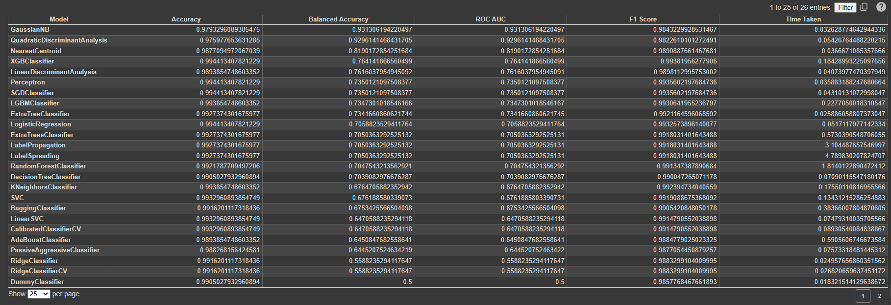
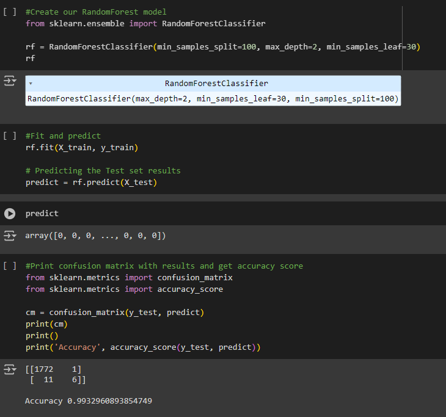
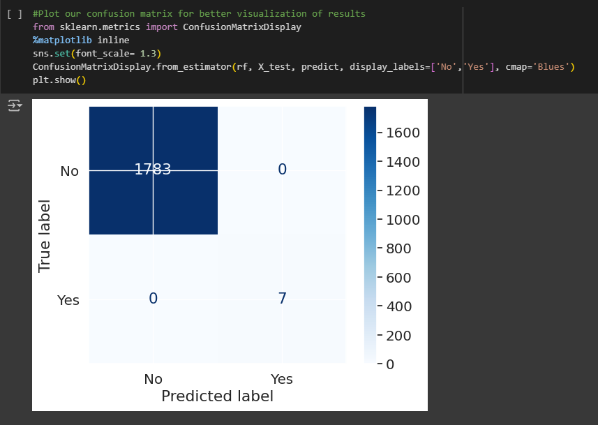
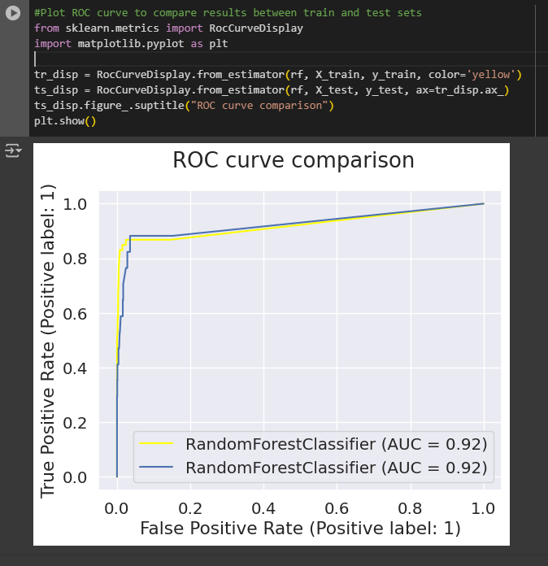

# Stori Data Challenge With Lazy Predict

## Stori Data Challenge With Lazy Predict (Fraud Detection Machine Learning Model) 

This dataset contains 8,950 rows and 22 tables: cust_id, activated_date, last_payment_date, balance, balance_frequency, purchases, oneoff_purchases, installments_purchases, cash_advance, purchases_frequency, 
oneoff_purchases_frequency, purchases_installments_frequency, cash_advance_frequency, cash_advance_trx, purchases_trx, credit_limit, payments, minimum_payments, prc_full_payment, tenure and the dependant 
variable, fraud.

The coding challenge consists of generating an efficient and trustworthy Predictive Model to detect fraud between clients for the Stori Credit Card Company.

## Content

The notebook contains the following questions and tasks:

### 1.1 Plot a histogram of the balance amount for all the customers.  

Histogram shows a right-skewed graph (positive skewness), locating most of its values (balances) between 0 and 2054.14, which extends to the 75% percentile.  

### 1.2 Report any structure you find and any hypotheses you have about that structure.  

Looking at the balance values grouped by fraud (0, 1), we could say that those 70 cases of fraud are mostly located between the 50% and the 75% percentiles based on its mean value. Plus, these amounts are greater than the ones from the 8880 (no fraud) cases. That might be a relevant pattern. 
Something similar happens to purchases values grouped by fraud. In this case purchases values are way greater for those 70 fraud cases than for the other 8880.  

### 1.3 Report mean and median balance, grouped by year and month of activated_date.  

### 2.1 Report in a table the following information for customers who activated their account and made their last payment during 2020: cust_id (excluding letters), activated_date (in format YYYY-MM), last_payment_date (in format YYYY-MM-DD), cash_advance, credit_limit, and a calculated field of cash_advance as a percentage of credit_limit.  

### 3.1 Build a predictive model for fraud.  

As we can see all models for classification work perfectly with our dataset, since they all show accuracy and F1 scores above 98%.
I'll choose Random Forest as this is one model that performs better after hyperparameter tunning.

We have to take into consideration for interpreting these results that this dataset has only 70 fraud cases out of nearly 9000 and then we split our data to 80-20% for training and testing, which means we'd only be working with a very small amount of those cases to fit our model.  

### 3.2 What explanatory variable was the most powerful predictor for fraud?  

Balance had the most correlations with other vars, but purchases was highly correlated to fraud, therefore, those two definitely had a lot to do with our output var.  

## Google Colab Notebook Link

https://github.com/sasl09/StoriDataChallengeWithLazyPredict

## Project Files

-README.md 
-StoriDataChallengeWithLazyPredict.zip 

## Author

Saul Solis
